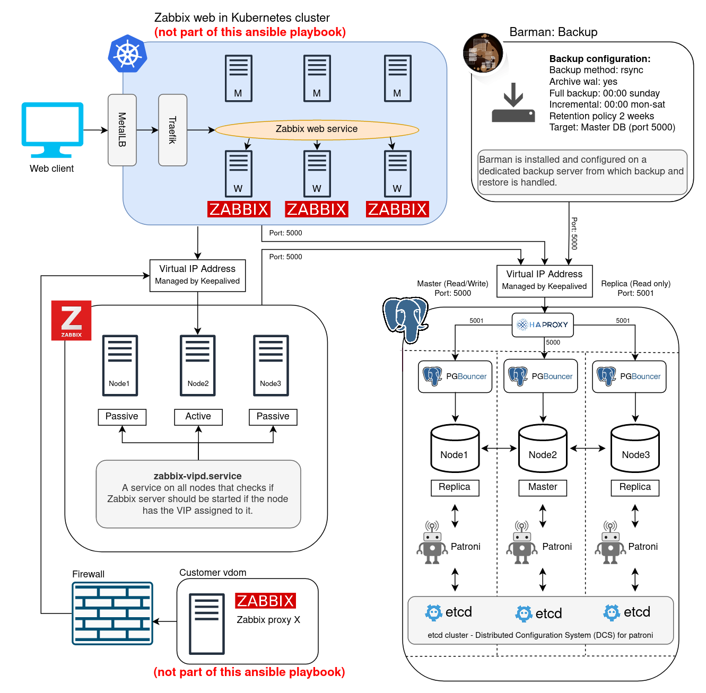

# HA Zabbix servers with HA PostgreSql cluster 

## Table of contents
- [HA Zabbix servers with HA PostgreSql cluster](#ha-zabbix-servers-with-ha-postgresql-cluster)
  - [Table of contents](#table-of-contents)
  - [Introduction](#introduction)
    - [Zabbix servers:](#zabbix-servers)
    - [Postgres cluster:](#postgres-cluster)
    - [Barman backup:](#barman-backup)
    - [Topology:](#topology)
- [Requirements](#requirements)
    - [Servers and IP addresses:](#servers-and-ip-addresses)
    - [Dependencies:](#dependencies)
    - [SSH connection to all hosts:](#ssh-connection-to-all-hosts)
- [Configuration](#configuration)
    - [Inventory](#inventory)
    - [Vault and Passwords](#vault-and-passwords)
    - [LVM](#lvm)
    - [Zabbix Server](#zabbix-server)
    - [PostgreSQL](#postgresql)
    - [PostgreSQL Tune](#postgresql-tune)
    - [Backup](#backup)
- [Usage](#usage)
- [Backup and Restore](#backup-and-restore)
  - [Pre-checks:](#pre-checks)
  - [Automated Restore with Ansible:](#automated-restore-with-ansible)
  - [Manual Restore:](#manual-restore)
- [Versions](#versions)
- [Troubleshooting](#troubleshooting)
    - [Zabbix-server](#zabbix-server-1)
    - [Keepalived](#keepalived)
    - [PgBouncer](#pgbouncer)
## Introduction
<b>This Playbook will deploy a high-availability [Zabbix](https://www.zabbix.com/features) monitoring solution with a PostgreSQL high-availability cluster (based on [Patroni](https://github.com/zalando/patroni) and "DCS(etcd)") populated with the Zabbix schema and [TimescaleDB](https://www.timescale.com/) extension, three Zabbix servers with failover capability and a dedicaded backup server with [Barman](https://www.pgbarman.org/).</b>

This project is an extension of [Vitabaks postgres cluster](https://github.com/vitabaks/postgresql_cluster/) project and will also setup the following:
- Configures an additional partition with LVM.
- Installs PostgreSQL and Timescaledb-extension.
- Changes the data directory for Postgres to /opt/data/ in the newly created LVM volume group.
- Deploys Postgres cluster.
- Populates database with Zabbix schema.
- Installs and applies TimescaleDB extension on Zabbix database. 
- Configures [Pgbouncer](https://github.com/pgbouncer/pgbouncer) to allow Zabbix and Barman into the connection pool.
- Deploys Zabbix servers with failover capability.
- Installs and configures Barman backup.

### Zabbix servers:
The Zabbix server is installed on three servers where only one <b>zabbix-server.service</b> is active at a time with the help of <b>zabbix-vipd.service</b>. It starts or stops the <b>zabbix-server.service</b> based on if the host has a virtual IP attached to it. The virtual IP is provided by [Keepalived](https://github.com/acassen/keepalived).


### Postgres cluster:
The Postgres Cluster is deployed on three servers where one becomes the leader which has streaming replication to the replicas. Patroni uses [etcd](https://github.com/etcd-io/etcd) for Distributed Consensus to choose leader/replica roles for the cluster and to store information about the status of the cluster and PostgreSQL configuration parameters.

 The cluster is reachable through a virtual IP provided by Keepalived and loadbalanced by HAProxy. This provides the ability to distribute the load on reading:
<b>
- port 5000 (read / write) leader
- port 5001 (read only) all replicas
</b>

### Barman backup:
Barman is installed on a dedicated backup server from which both backup and restore is handled through rsync. See the [Backup and Restore](#backup-and-restore) section for more information regarding this. 

### Topology:

<i>Note: The Kubernetes cluster with the Zabbix web is not part of this ansible playbook.</i>

# Requirements

This playbook requires root privileges or sudo.

### <b>Servers and IP addresses:</b>
- 7 servers:
    - 3 servers for the database cluster each with an extra disk where Postgres will store all data.
    - 3 servers for the Zabbix server cluster.
    - 1 server as dedicated backup server.
- 2 extra IP addresses as VIP for database and zabbix clusters.

### Dependencies:

1. Install pip and sshpass:
```bash
sudo apt install python3-pip sshpass -y
```
2. Install Ansible:
```bash
sudo pip3 install ansible
```
3. Run following command to install dependencies:
```sh
pip3 install -r prerequisites/requirements.txt
```
4. Run following command to install ansible collections:
```sh
ansible-galaxy collection install -r prerequisites/collections.yaml
```
### SSH connection to all hosts:
Ansible uses SSH to deploy configurations so you need to set up key exchange to all hosts:
```bash
ssh-copy-id ubuntu@<IP address>
```

# Configuration

### Inventory
Edit the inventory file by adding designated IP addresses for Zabbix, database and backup servers in <b>hosts.ini</b>. Also add your databases hostnames to the hostname variables in "master" and "replica" groups.

### Vault and Passwords
The deployment of this setup requires user credentials for database connections, replication user for postgres and backup user, which needs to be vaulted.

1. In the <b>ansible.cfg</b> file the vault_password_file variable points to a file called <b>.vaultpass</b>. This file is added to <b>.gitignore</b> so it won't be version controlled for safety.

    Create <b>.vaultpass</b> and add your vault password:
```bash
# vim .vaultpass
<your password>
```
2. Add zabbix db user and barman user passwords to <b>group_vars/all/vault</b>:
```bash
# vim group_vars/all/vault
vault_zabbix_db_user_pass: <zabbix password> 
vault_backup_user_pass: <barman password>
```
3. Add patroni superuser (postgres) and patroni replication (replicator) password to <b>group_vars/postgres_cluster/vault</b>: 
```bash
# vim group_vars/postgres_cluster/vault
vault_patroni_superuser_password: <superuser password>
vault_patroni_replication_password: <replicator pass>
```
4. Add keepalived authentication password to <b>group_vars/zabbix_server/vault</b>:
```bash
# vim group_vars/zabbix_server/vault
vault_keepalived_auth_pass: <keepalived password>
```
5. Encrypt these files:
```bash
ansible-vault encrypt group_vars/*/vault
```
### LVM
1. This playbook configures an additional partition with LVM where Postgres will store all it's data. Edit the LVM variables located in <b>group_vars/postgres_cluster/vars</b> for your needs.
```bash
# vim group_vars/postgres_cluster/vars
```

### Zabbix Server
1. The Zabbix server cluster will be reachable via the VIP address you specify in <b>group_vars/zabbix_server/vars</b> 
```bash
# vim group_vars/zabbix_server/vars
zabbix_server_vip: <zabbix VIP address>
```
2. The <b>zabbix-server.conf</b> is templated to each server. All values are currently set to Zabbix own default so further configuration should be made in that file:
```bash
# vim roles/zabbix-server/templates/zabbix_server.conf.j2  
```

### PostgreSQL
1. The Postgres cluster will be reachable via the VIP address you specify in /<b>group_vars/all/vars</b> 
```bash
# vim group_vars/all/vars
postgres_cluster_vip: <postgres VIP address>
```
2. Further configuration, such as creating additional databases, users, allowed connections, connection pooling with pgbouncer and so forth can be made in <b>vars/main.yml</b> if needed:
```bash
# vim vars/main.yml
```
3. If changing the PostgreSQL version, please edit <b>group_vars/postgres_cluster/vars</b> and <b>vars/main.yml</b>
```bash
# vim vars/main.yml
# vim group_vars/postgres_cluster/vars
postgresql_version: "13" # 11,12,13 are valid
```

### PostgreSQL Tune
Since tuning of Postgres should be based on CPU, RAM, and estimated max connections you have to know these values and configure the parameters in <b>vars/main.yml</b> accordingly. You can use [this site](https://pgtune.leopard.in.ua/#/) to get start values based on your hardware.
1. All Postgres parameters regarding tuning are located in <b>vars/main.yml</b> under the postgresql_parameters section:
```bash
# vim vars/main.yml
```
### Backup
By default backups are performed at 00:00 every day by a cron job and old backups are rotated out after 2 weeks. You can change these settings in <b>group_vars/barman/vars</b>:
```bash
# vim group_vars/barman/vars
```

# Usage
Run playbook when all configurations are done:
```bash
ansible-playbook main.yaml
```

# Backup and Restore
## Pre-checks:
1. Run following command on one of the db 
  servers to get an overview of the cluster 
  and take  note on which nodes are 
  leader/replicas:
  ```bash
  sudo patronictl list
  ```                      
2. Locate backup ID from the backup 
  you want to restore from running following 
  command on the backup server as the barman
  user:
  ```bash
  barman list-backup postgres_cluster
  ```                             

3. For more information about the selected
  backup run:
  user:
  ```bash
  barman show-backup postgres_cluster <backup ID> 
  ```                    

## Automated Restore with Ansible:

The restore procedure is automated in the 
<b>barman-restore.yaml</b> playbook. Make sure
the hosts in "master" and "replica" groups in <b>hosts.ini</b>
reflects the current leader/relica cluster status.

Run following command to restore from backup:
  ```bash
  ansible-playbook --extra-vars "backup_id=<backup ID>" barman-restore.yaml 
  ```

## Manual Restore:

| # | Host             | Action                                            |command                                      |
|---|------------------|---------------------------------------------------|---------------------------------------------|
|1. | Replicas         | Stop Patroni service  |sudo systemctl stop patroni|
|2. | Master           | Stop Patroni service  |sudo systemctl stop patroni|
|3. | Master           | Remove Patroni cluster from DCS  |sudo etcdctl rm /service/postgres-cluster --recursive |
|4. | All              | Stop PostgreSql service  |sudo systemctl stop postgresql|
|5. | All              | Remove Postgres data directory |sudo rm -r /opt/data/postgresql/12/main|
|6. | Barman           | Restore from backup (as barman user) |barman recover --remote-ssh-command "ssh postgres@\<leader IP> postgres_cluster \<backup ID> \<data dir path>|
|7. | Master           | Start Patroni service|sudo systemctl start patroni|
|8. | Master           | Wait for Postgres Recovery to complete  ||
|9. | Master           | Check if Postgres is started  |sudo systemctl status postgresql|
|10.| Master           |Check if Postgres is accepting connections||
|11.|Localhost & master| Make sure the postgresql users (superuser and replication) are present, and password does not differ from the specified in group_vars/postgres_cluster/vault||
|12.| Master           | Update postgresql authentication parameter in patroni.yml (if superuser or replication users is changed)|sudo vim /etc/patroni/patroni.yml|
|13.| Master           | Reload patroni service (if patroni.yml is updated)|sudo systemctl reload patroni|
|14.| Replicas         | Start Patroni service|sudo systemctl start patroni|
|15.| Replicas         | Check that Patroni is healthy||
|16.| Master           | Check postgresql cluster health||

# Versions
|Software       |Version  |
|---------------|--------:|
|PostgreSQL:    |13.x     |
|Zabbix server  |5.0.x    |
|Zabbix agents  |5.0.x    |
<br>

# Troubleshooting

### Zabbix-server
  - Log: /var/log/zabbix/zabbix_server.log
  - Conf: /etc/zabbix/zabbix_server.conf
  - Zabbix-Keepalived-Service-log: sudo journalctl -u zabbix-vipd.service/timer

### Keepalived
  - Log: sudo journalctl -u keepalived.service  
  - Conf: /etc/keepalived/keepalived.conf
 
### PgBouncer
  - Log: /var/log/pgbouncer/pgbouncer.log
  - Conf: /etc/pgbouncer/pgbouncer.ini
  - Conf: /etc/pgbouncer/userlist.txt

### Patroni
  - Log: /var/log/patroni/patroni.log
  - Conf: sudo patronictl edit-config

### PostgreSQL
  - Log: /var/log/postgresql/postgresql-{day}.log
  - Log: /var/log/postgresql/postgresql-12-main.log
  - Conf-dir: /etc/postgresql/12/main/

### Barman
  - Log: /var/log/barman/barman.log
  - Barman-global-conf: /etc/barman.conf
  - Barman-server-conf: /etc/barman.d/postgres_cluster.conf
  - Barman-password-file: /var/lib/barman/.pgpass
  - Barman-postgresql-backups: /var/lib/barman/postgres_cluster/
